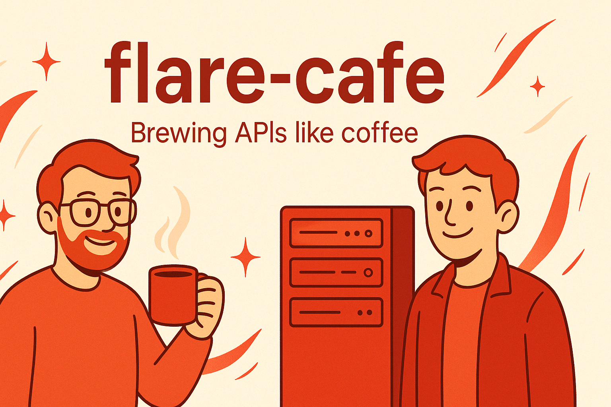

# 🔥 flare-cafe 

### Brewing APIs like coffee. @lumiflare, @bright-flare



<br>

## Project settings

<br>

### Sdkman install

```bash
curl -s "https://get.sdkman.io" | bash
```

```bash
source "$HOME/.sdkman/bin/sdkman-init.sh"
```

<br>

### Java 21 install
```bash
sdk install java 21.0.5-tem
```
```bash
sdk use java 21.0.5-tem
```
```bash
sdk home java 21.0.5-tem
```

<br>

### Docker mysql container run

```bash
docker run -d -p 3306:3306 --name flare-cafe -e MYSQL_ROOT_PASSWORD=1234 mysql:9.0
```
```bash
docker ps
```
```bash
docker exec -it flare-cafe bash
```

<br>

### Mysql bash

```sql
mysql -u root -p

create database `flare-cafe`;

use `flare-cafe`;

create user 'flare-cafe-user' identified by '1234';

create user 'flare-cafe-user'@'localhost' identified by '1234';

grant all privileges on `flare-cafe`.* to 'flare-cafe-user'@'%' with grant option;
```