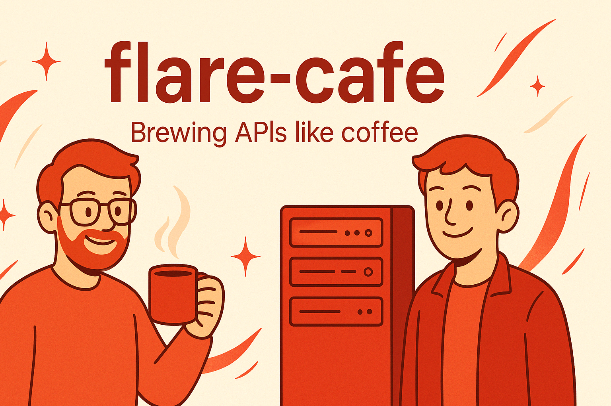
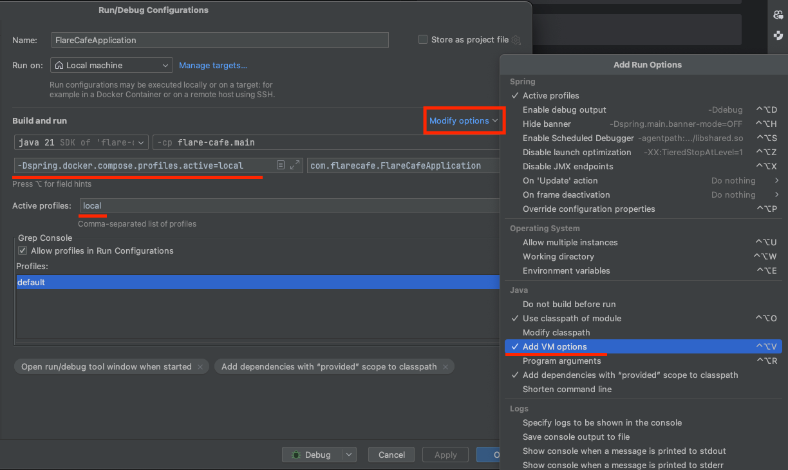

# 🔥 flare-cafe 

### Brewing APIs like coffee. @lumiflare, @bright-flare



<br>

## Project settings

<br>

### 1. Sdkman install

```bash
curl -s "https://get.sdkman.io" | bash
```

```bash
source "$HOME/.sdkman/bin/sdkman-init.sh"
```

<br>

### 2. Java 21 install
```bash
sdk install java 21.0.5-tem
```
```bash
sdk use java 21.0.5-tem
```
```bash
sdk home java 21.0.5-tem
```

<br>

### 3. CLI Run

```bash
./gradlew clean build
```

```bash
docker compose --profile local up -d
```

```bash
java -jar ./build/libs/flare-cafe.jar --spring.profiles.active=local --spring.docker.compose.profiles.active=local
```

<br>

### 4. IDE Run


